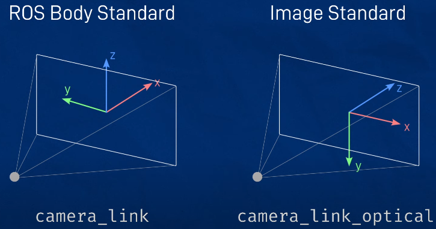

# Gazebo

## Install
```bash
sudo apt-get install ros-$ROS_DISTRO-gazebo-ros-pkgs ros-$ROS_DISTRO-gazebo-ros-control
```

Check your installation:
```bash
ros2 pkg list | grep gazebo
```

Version check:
```bash
gazebo --version
which gzserver
which gzclient
```

---

## kill
```bash
killall -9 gzserver gzclient
```

---

## Launch gazebo
```bash
ros2 launch gazebo_ros gazebo.launch.py world:=$(ros2 pkg prefix --share my_package)/worlds/my_world.world
```
Or from launch file:
```python
world = os.path.join(get_package_share_path(package_name), 'worlds/my_world.world')
gz_params_file = os.path.join(get_package_share_path(package_name), 'config/gazebo_params.yaml')
gazebo = IncludeLaunchDescription(
    PythonLaunchDescriptionSource([
        os.path.join(get_package_share_directory('gazebo_ros'),'launch','gazebo.launch.py'
    )]),
    launch_arguments={
        'world': world,
        'params_file': gz_params_file,
        # 'extra_gazebo_args': '--ros-args --params-file ' + gazebo_params_file
    }.items()
)
```
- The `world` argument is optional. If ommited, an empty world will be loaded.
- The yaml `gazebo_params.yaml` can look like this:
    ```yaml
    gazebo:
    ros__parameters:
        publish_rate: 400.0 # Hz, the rate at which gazebo publishes joints, sensor msgs etc.
    ```
- `gazebo.launch.py` launches two other launch files:
    - `gzclient.launch.py`
    - `gzserver.launch.py`\
    Run `ros2 launch gazebo_ros gzserver.launch.py --show-args` to see the full list of arguments you can pass to gazebo.
---

## Spawn urdf model
```bash
ros2 run gazebo_ros spawn_entity.py -topic robot_description -entity my_bot
```
Or from launch file:
```python
spawn_entity = Node(
    package='gazebo_ros',
    executable='spawn_entity.py',
    arguments=[
        '-topic', 'robot_description',
        '-entity', 'my_bot'
    ]
)
```

## Gazebo tags
```xml
<!-- reference an existing link -->
<gazebo reference="<link_name>">

    <!-- color -->
    <material>Gazebo/Green</material>

    <!-- friction coefficients -->
        <mu1 vakue="0.001"/>
        <mu2 vakue="0.001"/>

    <!-- sensor -->
    <sensor type="<builtin_sensor_type>" name="<my_sensor_name>">
        <!-- sensor params -->

        <!-- plugin to handle the sensor -->
        <plugin name="<builtin_plugin_name>" filename="libgazebo_ros_<plugin>.so">
            <!-- plugin params -->
        </plugin>
    </sensor>
</gazebo>
```

---

## `joint_state_publisher`

```xml
<!-- publish the joint_states for the selected joints (which robot_state_publisher can then use to broadcast the approprate tf). -->

<gazebo>
    <plugin name="gazebo_ros_joint_state_publisher"
        filename="libgazebo_ros_joint_state_publisher.so">
        <update_rate>20</update_rate>
        <joint_name>my_joint1</joint_name>
        <joint_name>my_joint2</joint_name>
        <joint_name>my_joint3</joint_name>
    </plugin>
</gazebo>
```

---

## `joint_pose_trajectory`

```xml
<!-- reads JointTrajectory message from the topic 
    /set_joint_trajectory 
    and moves the robot accordingly. -->

<gazebo>
    <plugin name="gazebo_ros_joint_pose_trajectory"
        filename="libgazebo_ros_joint_pose_trajectory.so">
        <update_rate>2</update_rate>
    </plugin>
</gazebo>
```
Example command message:
```bash
ros2 topic pub -1 /set_joint_trajectory trajectory_msgs/msg/JointTrajectory '{header: {frame_id: world}, joint_names: [slider_joint, arm_joint], points: [  {positions: {0.8,0.6}} ]}'
```
---

## `camera sensor`

Define camera and optical link:

<p align="left">
  
</p>

```xml
<joint name="camera_joint" type="fixed">
    <parent link="chassis"/>
    <child link="camera_link"/>
    <origin xyz="0.276 0 0.181" rpy="0 0.18 0"/>
</joint>

<link name="camera_link">
    <visual>
        <geometry>
            <box size="0.010 0.03 0.03"/>
        </geometry>
        <material name="black"/>
    </visual>
    <visual>
        <origin xyz="0 0 -0.05"/>
        <geometry>
            <cylinder radius="0.002" length="0.1"/>
        </geometry>
        <material name="black"/>
    </visual>
</link>

<!-- An extra joint/link is required to create an "optical frame" for the sensor. For more see https://www.ros.org/reps/rep-0103.html#suffix-frames -->

<joint name="camera_optical_joint" type="fixed">
    <parent link="camera_link"/>
    <child link="camera_link_optical"/>
    <origin xyz="0 0 0" rpy="${-pi/2} 0 ${-pi/2}"/>
</joint>

<link name="camera_link_optical"></link>
```

For **`image sensor`**:
```xml
<gazebo reference="camera_link">
    <material>Gazebo/Black</material>

    <sensor name="my_camera" type="camera">
        <pose> 0 0 0 0 0 0 </pose>
        <!-- To visualize img in gazebo. -->
        <visualize>true</visualize>
        <update_rate>10</update_rate>
        <camera>
            <horizontal_fov>1.089</horizontal_fov> <!-- rads -->
            <image>
                <!-- 8-bits for red/gree/blue -->
                <format>R8G8B8</format> 
                <width>640</width>
                <height>480</height>
            </image>
            <clip>
                <near>0.05</near>
                <far>8.0</far>
            </clip>
            <!-- <noise>
                <type>gaussian</type>
                <mean>0.0</mean>
                <stddev>0.007</stddev>
            </noise> -->
        </camera>
        <!-- creates the node: /my_camera_controller -->
        <plugin name="my_camera_controller" filename="libgazebo_ros_camera.so">
            <frame_name>camera_link_optical</frame_name>
        </plugin>
    </sensor>
</gazebo>
```

For **`depth sensor`**:
```xml
<gazebo reference="camera_link">
    <material>Gazebo/Red</material>

    <sensor name="my_camera" type="depth">
        <pose> 0 0 0 0 0 0 </pose>
        <!-- Although visualise is set to true, it won't 
        actuallyvisualise the depth camera in gazebo. -->
        <visualize>true</visualize>
        <update_rate>10</update_rate>
        <camera>
            <horizontal_fov>1.089</horizontal_fov>
            <image>
                <!-- for depth, use BGR instead of RGB -->
                <format>B8G8R8</format>
                <width>640</width>
                <height>480</height>
            </image>
            <clip>
                <near>0.05</near>
                <far>8.0</far>
            </clip>
        </camera>
        <!-- creates the node: /my_camera_controller -->
        <plugin name="my_camera_controller" filename="libgazebo_ros_camera.so">
            <frame_name>camera_link_optical</frame_name>
            <min_depth>0.1</min_depth>
            <max_depth>100.0</max_depth>
        </plugin>
    </sensor>
</gazebo>
```
- Topics are prefixed by `/<sensor:name>/`, i.e.:
    ```bash
    /my_camera/image_raw
    /my_camera/camera_info
    /my_camera/...
    ```
- The gazebo tag references the `camera_link`, while the `camera_controller plugin` uses the `camera_link_optical`.

---

## `lidar`
```xml
<gazebo reference="laser_frame">
    <material>Gazebo/Black</material>

    <sensor name="laser" type="ray">
        <pose> 0 0 0 0 0 0 </pose>
        <visualize>false</visualize>
        <update_rate>10</update_rate>
        <ray>
            <scan>
                <horizontal>
                    <samples>360</samples>
                    <min_angle>-3.14</min_angle>
                    <max_angle>3.14</max_angle>
                </horizontal>
            </scan>
            <range>
                <min>0.3</min>
                <max>12</max>
            </range>
        </ray>
        <!-- creates the node: /my_laser_controller -->
        <plugin name="my_laser_controller" filename="libgazebo_ros_ray_sensor.so">
            <ros>
                <argument>~/out:=my_scan_topic</argument> <!-- msgs will be published to '/my_scan_topic' -->
            </ros>
            <output_type>sensor_msgs/LaserScan</output_type>
            <frame_name>laser_frame</frame_name>
        </plugin>
    </sensor>
</gazebo>

```
Messages are published to `/my_scan_topic`. \
Example code for `laser_frame`:
```xml
<joint name="laser_joint" type="fixed">
    <parent link="<laser_parent_link>"/>
    <child link="laser_frame"/>
    <origin xyz="0.122 0 0.212" rpy="0 0 0"/>
</joint>

<link name="laser_frame">
    <visual>
        <geometry>
            <cylinder radius="0.05" length="0.04"/>
        </geometry>
        <material name="black"/>
    </visual>
    <visual>
        <origin xyz="0 0 -0.05"/>
        <geometry>
            <cylinder radius="0.01" length="0.1"/>
        </geometry>
        <material name="black"/>
    </visual>
    <collision>
        <geometry>
            <cylinder radius="0.05" length="0.04"/>
        </geometry>
    </collision>
    <xacro:inertial_cylinder mass="0.1" length="0.04" radius="0.05">
        <origin xyz="0 0 0" rpy="0 0 0"/>
    </xacro:inertial_cylinder>
</link>
```

---

## Teleop

```bash
ros2 run teleop_twist_keyboard teleop_twist_keyboard
``` 

---

## Notes

- `odom` frame tells us where the robot is w.r.t. the initial gazebo pose of the robot.
- Add damping to the joints to stop them it flopping around. e.g. `<dynamics damping="10.0" friction="10.0"/>`
- Define `inertia` for `links` attached to **not-fixed** `joints`.