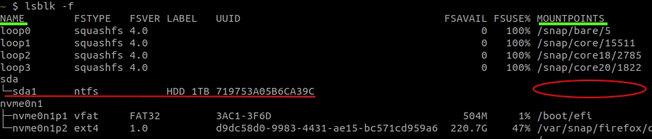

# gcc - g++

## Update version from 11 to 12 (Ununtu 22.04)

```bash
# download packages
sudo apt-get install -y gcc-11 gcc-12
sudo apt-get install -y g++-11 g++-12

# remove previous alternatives
sudo update-alternatives --remove-all gcc 
sudo update-alternatives --remove-all g++

# setup alternatives
sudo update-alternatives --install /usr/bin/gcc gcc /usr/bin/gcc-11 10
sudo update-alternatives --install /usr/bin/gcc gcc /usr/bin/gcc-12 20
sudo update-alternatives --set cc /usr/bin/gcc

sudo update-alternatives --install /usr/bin/g++ g++ /usr/bin/g++-11 10
sudo update-alternatives --install /usr/bin/g++ g++ /usr/bin/g++-12 20
sudo update-alternatives --set c++ /usr/bin/g++

# select default versions:
sudo update-alternatives --config gcc
sudo update-alternatives --config g++
```

---

# Java version
```bash
sudo update-alternatives --config java
```

---

# bash autocompletion for ROS

```bash
sudo apt-get update && apt-get install -y git-core bash-completion \
  && echo "if [ -f /opt/ros/${ROS_DISTRO}/setup.bash ]; then source /opt/ros/${ROS_DISTRO}/setup.bash; fi" >> /home/$USERNAME/.bashrc \
  && echo "if [ -f /usr/share/colcon_argcomplete/hook/colcon-argcomplete.bash ]; then source /usr/share/colcon_argcomplete/hook/colcon-argcomplete.bash; fi" >> /home/$USERNAME/.bashrc
```

---

# Symbolik link

Create symbolic link and make it "global" by putting it in `/usr/local/bin/`:
```bash
# create the symbolic link and place it inside /usr/local/bin/ with name e.g. "matlab16b"
sudo ln -s /home/slifer/MATLAB/R2016b/bin/matlab /usr/local/bin/matlab16b

# to remove that link simply do:
sudo rm /usr/local/bin/matlab16b
```

---

# Make script global
- use `alias`:
  ```bash
  echo "alias matlab20a=./MATLAB/R2020a/bin/matlab" >> ~/.bashrc
  ```
- create symbolik link: \
see [symbolic link](#symbolik-link)

---

# Mount

## Mount ISO
```bash
# Display all disks and their mount locations:
lsblk -f

# Assume we want "/dev/sdb2" (or "Downloads/Matlab/MatlabR2018b_disk1.iso")

# Create a mount point, say "driver2"
sudo  mkdir /mnt/drive2

# Mount
sudo mount /dev/sdb2 /mnt/drive2/

# When you're done, unmount:
sudo umount /mnt/drive2 
sudo rm -rf /mnt/drive2
```

## Mount read-only
Locate the drive `NAME`:
```bash
lsblk -f
```

<p align="left">
  
</p>

Suppose we want to mount `"/dev/sda1"` (I ain't sure why `"dev/"` and not `"sda/"` :P). \
At the column `MOUNTPOINTS` column there is no mount point, so create one:
```bash
sudo mkdir /media/${USERNAME}/my_mount_79CE9D6
```
Mount the drive in `read only mode`:
```bash
sudo mount -t "ntfs" -ro "uhelper=udisks2,nodev,nosuid,uid=1000,gid=1000" "/dev/sda1" "/media/${USERNAME}/my_mount_79CE9D6"
```

---

# Screen resolution

```bash
sudo gedit /etc/default/grub
# Find GRUB_GFXMODE and change to the resolution you want, e.g. GRUB_GFXMODE=2560x1440
```

---

# Choose boot kernel

```bash
# List available options
sudo grep 'menuentry \|submenu ' /boot/grub/grub.cfg | cut -f2 -d "'"

# sample output:
Ubuntu
Advanced options for Ubuntu
Ubuntu, with Linux 5.13.0-37-generic
Ubuntu, with Linux 5.13.0-37-generic (recovery mode)
Ubuntu, with Linux 5.11.0-27-generic
Ubuntu, with Linux 5.11.0-27-generic (recovery mode)
UEFI Firmware Settings


# Edit default grub:
sudo gedit /etc/default/grub

# Find GRUB_DEFAULT and specify path to the grub menu entry. E.g.
# GRUB_DEFAULT='Advanced options for Ubuntu>Ubuntu, with Linux 5.11.0-27-generic'

# Update grub
update-grub
```

---

# Real time (RT)

```bash
sudo bash -c "echo -e '\n \
${USERNAME} hard rtprio 99\n \
${USERNAME} soft rtprio 99\n \
${USERNAME} hard memlock unlimited\n \
${USERNAME} soft memlock unlimited\n \
' >> /etc/security/limits.conf"

sudo bash -c "echo -e '\nsession required pam_limits.so' >> /etc/pam.d/common-session"
```
Reboot, open a terminal, and run: 
```bash
ulimit -r -l
```
You should get:
```bash
real-time priority                  (-r) 99
max locked memory           (kbytes, -l) unlimited
```

---


# Kill all
```bash
killall -9 <process_name>
```

---